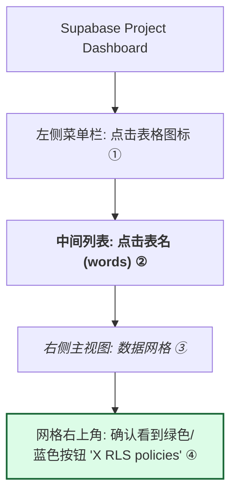

# Supabase 数据库设置指南

本文档说明如何在 Supabase 中创建词汇本应用所需的数据库表。

## 前提条件

1. 已注册 [Supabase](https://supabase.com) 账号
2. 已创建一个新项目

## 步骤一：获取项目凭证

1. 进入 Supabase 项目 Dashboard
2. 点击左侧 **Settings** → **API**
3. 复制以下信息到 `.env` 文件：

```env
VITE_SUPABASE_URL=https://your-project.supabase.co
VITE_SUPABASE_ANON_KEY=your-anon-key
```

## 步骤二：创建数据库表

在 Supabase Dashboard 左侧点击 **SQL Editor** → **New Query**，依次执行以下 SQL：

### 2.1 创建 `words` 表（词汇存储）

```sql
-- 创建单词表
CREATE TABLE words (
    id UUID DEFAULT gen_random_uuid() PRIMARY KEY,
    user_id UUID REFERENCES auth.users(id) ON DELETE CASCADE NOT NULL,
    word TEXT NOT NULL,
    meaning TEXT NOT NULL,
    language VARCHAR(2) NOT NULL CHECK (language IN ('en', 'de')),
    example TEXT,
    example_cn TEXT,
    category VARCHAR(20) DEFAULT '' CHECK (category IN ('', 'daily', 'professional', 'formal')),
    date DATE DEFAULT CURRENT_DATE,
    created_at TIMESTAMP WITH TIME ZONE DEFAULT NOW(),
    UNIQUE(user_id, word, language)
);

-- 创建索引
CREATE INDEX idx_words_user_id ON words(user_id);
CREATE INDEX idx_words_language ON words(language);
CREATE INDEX idx_words_date ON words(date);

-- 启用行级安全策略 (RLS)
ALTER TABLE words ENABLE ROW LEVEL SECURITY;

-- 用户只能访问自己的单词
CREATE POLICY "Users can view own words" 
    ON words FOR SELECT 
    USING (auth.uid() = user_id);

CREATE POLICY "Users can insert own words" 
    ON words FOR INSERT 
    WITH CHECK (auth.uid() = user_id);

CREATE POLICY "Users can update own words" 
    ON words FOR UPDATE 
    USING (auth.uid() = user_id);

CREATE POLICY "Users can delete own words" 
    ON words FOR DELETE 
    USING (auth.uid() = user_id);
```

### 2.2 创建 `saved_sentences` 表（收藏句子）

```sql
-- 创建收藏句子表
CREATE TABLE saved_sentences (
    id UUID DEFAULT gen_random_uuid() PRIMARY KEY,
    user_id UUID REFERENCES auth.users(id) ON DELETE CASCADE NOT NULL,
    sentence TEXT NOT NULL,
    sentence_cn TEXT,
    language VARCHAR(2) NOT NULL CHECK (language IN ('en', 'de')),
    scene VARCHAR(100),
    source_type VARCHAR(20) NOT NULL CHECK (source_type IN ('combined', 'word')),
    source_words JSONB DEFAULT '[]',
    created_at TIMESTAMP WITH TIME ZONE DEFAULT NOW()
);

-- 创建索引
CREATE INDEX idx_saved_sentences_user_id ON saved_sentences(user_id);
CREATE INDEX idx_saved_sentences_language ON saved_sentences(language);

-- 启用行级安全策略 (RLS)
ALTER TABLE saved_sentences ENABLE ROW LEVEL SECURITY;

-- 用户只能访问自己的收藏
CREATE POLICY "Users can view own saved sentences" 
    ON saved_sentences FOR SELECT 
    USING (auth.uid() = user_id);

CREATE POLICY "Users can insert own saved sentences" 
    ON saved_sentences FOR INSERT 
    WITH CHECK (auth.uid() = user_id);

CREATE POLICY "Users can delete own saved sentences" 
    ON saved_sentences FOR DELETE 
    USING (auth.uid() = user_id);
```

## 步骤三：配置认证

### 3.1 启用邮箱认证

1. 进入 **Authentication** → **Providers**
2. 确保 **Email** 已启用

### 3.2 配置重定向 URL

1. 进入 **Authentication** → **URL Configuration**
2. **Site URL**: 设置为生产环境域名（如 `https://your-domain.com`）
3. **Redirect URLs**: 添加重定向规则：
   - `http://localhost:5173/**`（开发环境）
   - `https://your-domain.com/**`（生产环境）

## 步骤四：验证设置

在 **Table Editor** 中确认以下表已创建：
- ✅ `words`
- ✅ `saved_sentences`

## 数据库结构概览

```
┌─────────────────────────────────────────────────┐
│ words                                           │
├─────────────────┬───────────────────────────────┤
│ id              │ UUID (主键)                   │
│ user_id         │ UUID (外键 → auth.users)      │
│ word            │ TEXT                          │
│ meaning         │ TEXT                          │
│ language        │ VARCHAR(2) [en/de]            │
│ example         │ TEXT                          │
│ example_cn      │ TEXT                          │
│ category        │ VARCHAR(20)                   │
│ date            │ DATE                          │
│ created_at      │ TIMESTAMP                     │
└─────────────────┴───────────────────────────────┘

┌─────────────────────────────────────────────────┐
│ saved_sentences                                 │
├─────────────────┬───────────────────────────────┤
│ id              │ UUID (主键)                   │
│ user_id         │ UUID (外键 → auth.users)      │
│ sentence        │ TEXT                          │
│ sentence_cn     │ TEXT                          │
│ language        │ VARCHAR(2) [en/de]            │
│ scene           │ VARCHAR(100)                  │
│ source_type     │ VARCHAR(20) [combined/word]   │
│ source_words    │ JSONB                         │
│ created_at      │ TIMESTAMP                     │
└─────────────────┴───────────────────────────────┘
```

## 如何验证 RLS 配置正确

核对以下详细步骤来确认你的数据库安全设置是否生效：

1.  **第一步**：点击左侧最上方的表格图标（**Table Editor**）。
2.  **第二步**：在列表中点击 `words` 或 `saved_sentences` 表。
3.  **第三步**：点击后进入**数据视图**（类似 Excel 的网格）。
4.  **第四步**：目光移至网格的**右上方**。
    - 你会看到一个标有 **`RLS policies`** 的按钮（例如：**`4 RLS policies`**）。
    - 只要能看到这个带数字的按钮，说明 RLS 已经成功启用并加载了策略。 ✅



### 状态核对表
- **显示 `4 RLS policies`**：配置完美生效 ✅（说明你成功执行了 SQL 脚本中的 4 条策略）。
- **显示 `RLS disabled`**：需要点击该按钮并选择 "Enable RLS"。
- **显示 `0 RLS policies`**：需要重新执行 SQL 脚本，以确保安全规则已写入。

> [!IMPORTANT]
> 必须看到 RLS 已启用且有 Policy，否则你的数据将对外部公开，或导致登录用户无法读写数据。

确保用户已登录后，应用才能根据这些策略正常读写数据。

### Q: 如何迁移本地数据？
应用首次登录时会自动将 LocalStorage 中的数据迁移到云端。

### Q: 忘记密码邮件没有收到？

这是 Supabase 开发中常见的问题，请按以下步骤排查：

1.  **检查垃圾邮件箱**：这是最常见的情况，Supabase 默认发送者经常被识别为垃圾邮件。
2.  **检查 Supabase 日志**：
    - 进入 **Authentication** → **Logs**。
    - 检查是否有错误信息。如果显示 `Email rate limit exceeded`，说明触发了频率限制。
3.  **频率限制 (Rate Limits)**：
    - Supabase 免费版默认每小时只能发送 **3 封** 认证相关邮件。
    - 如果你测试时短时间内点击多次，后面的邮件将不会发出。
4.  **检查 Email Templates**：
    - 进入 **Authentication** → **Email Templates** → **Reset Password**。
    - 确保它处于 **Enabled** 状态。
    - 检查 `Confirm Reset Password` 模板内容，确保没有误删 `{{ .ConfirmationURL }}`。

### Q: 点击邮件中的链接没有反应，或者报错？
- 确认 **Authentication** → **URL Configuration** 中的 `Redirect URLs` 必须配置正确。
- 开发测试请确保添加了 `http://localhost:5173/**`。
- 生产环境请确保添加了 `https://your-domain.vercel.app/**`。
